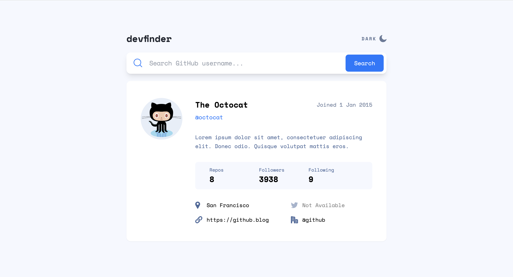

# Frontend Mentor - GitHub user search app solution

This is a solution to the [GitHub user search app challenge on Frontend Mentor](https://www.frontendmentor.io/challenges/github-user-search-app-Q09YOgaH6). Frontend Mentor challenges help you improve your coding skills by building realistic projects.

### The challenge

Users should be able to:

- View the optimal layout for the app depending on their device's screen size
- See hover states for all interactive elements on the page
- Search for GitHub users by their username
- See relevant user information based on their search
- Switch between light and dark themes

### Screenshot

### Links

- Solution URL: [frontendmentor](https://www.frontendmentor.io/solutions/responsive-github-user-search-app-made-with-react-and-tailwind-QVBwG4RxHk)
- Live Site URL: [netlify](https://tranquil-seahorse-3aac90.netlify.app/)

### Built with

- [React](https://reactjs.org/) - JS library
- [Recoil](https://recoiljs.org/) - Global state management
- [Tailwind CSS](https://tailwindcss.com/) - For styles
